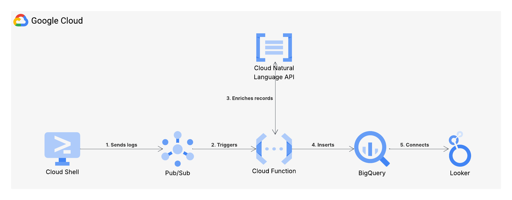
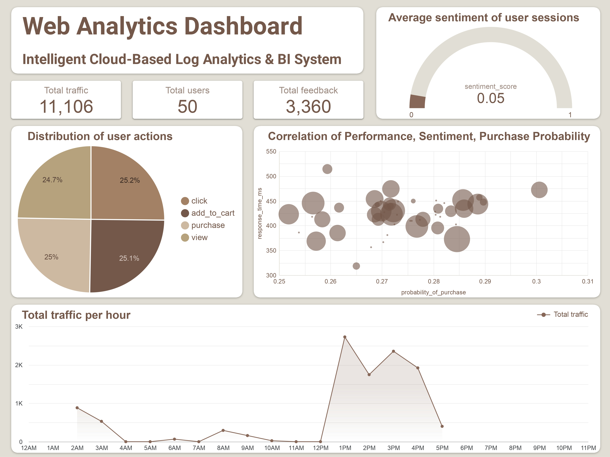

# Intelligent-Cloud-Based-Log-Analytics-BI-System
The system is designed to ingest simulated streaming activity logs, enrich them with artificial intelligence (AI), leverage machine learning (ML) to predict purchasing intent directly within a data warehouse environment, and then visualize the results to monitor system performance and customer satisfaction in real-time.

## I. Architecture
### 1. Overview
This project implements a serverless, real-time data streaming pipeline on Google Cloud Platform (GCP). The pipeline captures simulated user activity logs, performs real-time sentiment analysis, stores the processed data, and visualizes insights for business intelligence.

The logical flow, as illustrated in the Architecture Diagram, proceeds from left to right:
1.	Data Source (Cloud Shell) simulates and publishes logs.
2.	Ingestion (Pub/Sub) buffers the incoming message stream.
3.	Processing (Cloud Function) is triggered, calls the Cloud Natural Language API for enrichment, and inserts data.
4.	Storage (BigQuery) holds the analytical dataset and uses it to train a predictive model.
5.	Visualization (Looker Studio) provides an interactive dashboard.

### 2.	Component details
#### a.	Cloud Shell
Cloud Shell serves as the temporary development environment where the user activity simulator (Python Log Simulator Script) runs. It acts as the data producer in this pipeline.	
#### b.	Cloud Pub/Sub
Pub/Sub is the streaming message ingestion layer. It decouples the data source (simulator) from the processor (Cloud Function), ensuring high availability and a durable buffer for the log stream.
#### c.	Cloud Function
The Cloud Function acts as the central event processor. It runs on a specific Python runtime and is triggered by new messages on the Pub/Sub topic.
#### d.	Cloud Natural Language API
This managed ML API is called during data processing to enrich the raw logs with emotional context by calculating a sentiment score.
#### e.	BigQuery
BigQuery is the serverless, highly scalable Enterprise Data Warehouse used to store the analytical data. It also hosts the predictive ML models.
#### f.	Looker Studio
Looker Studio is the business intelligence tool used to visualize the processed data and AI insights through interactive dashboards.

### II. Dashboard

Link to dashboard: https://lookerstudio.google.com/u/0/reporting/49db7a85-2ca4-4fb4-852e-4ad6879d9743